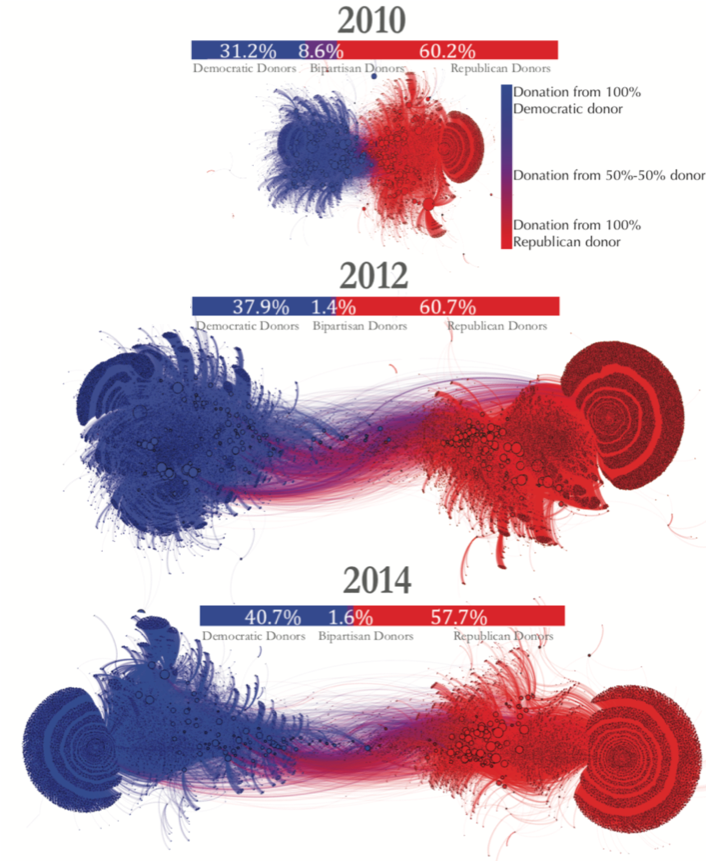
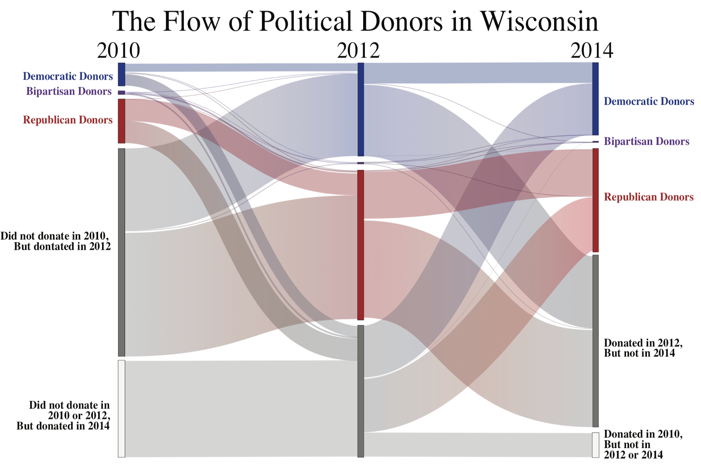
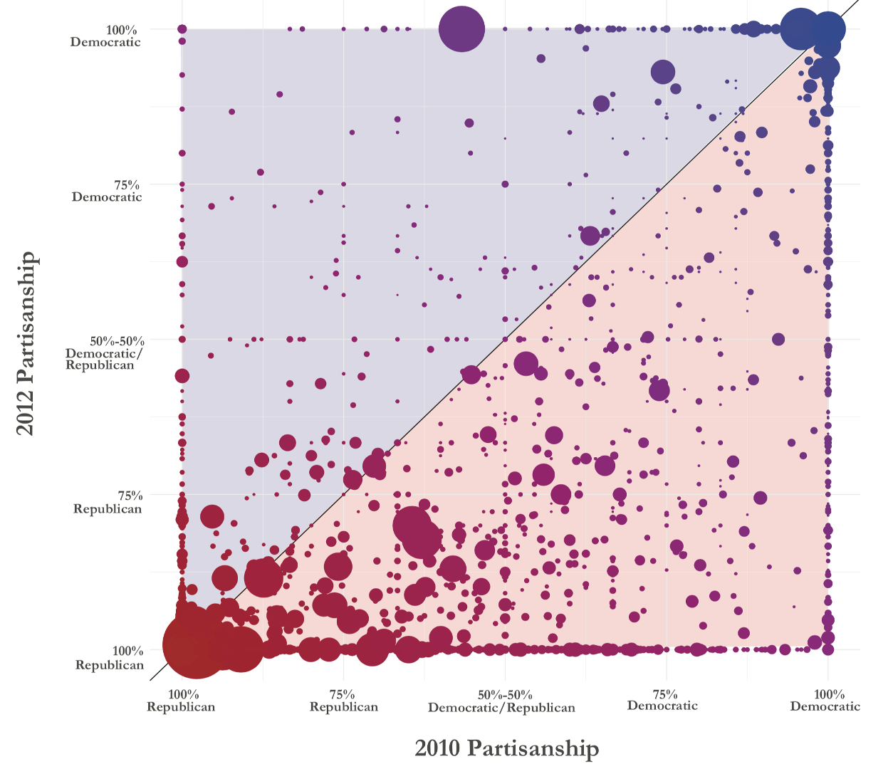
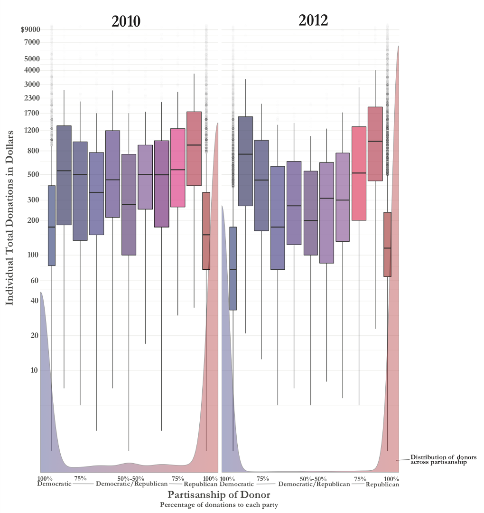
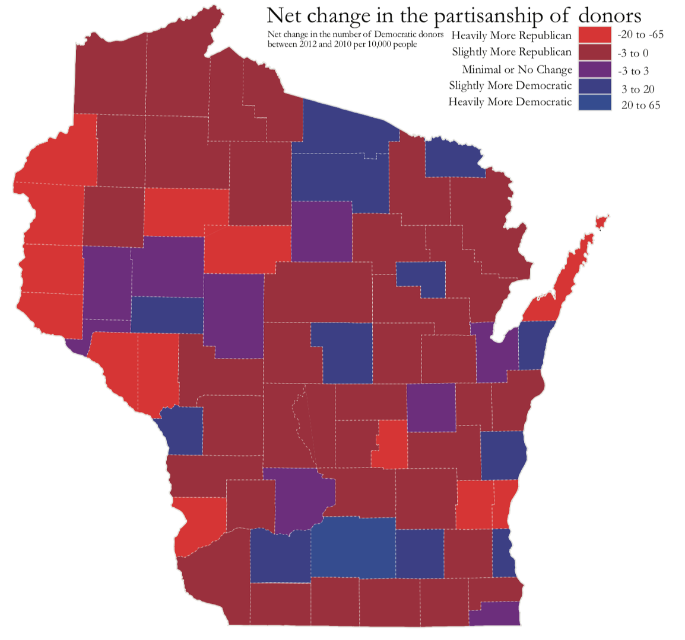

---
output:
  pdf_document:
    # citation_package: biblatex
    keep_tex: true
    fig_caption: true
    latex_engine: pdflatex
    template: ../svm-latex-ms.tex
title: "Political Donor Polarization "
thanks: 
author:
- name: "Ross Dahlke"
affiliation: 
abstract: "American politics has recently been defined by unprecedented levels of partisan polarization. Given the concurrent rise of the amount of money in politics, many have suggested a connection between money in politics and polarization. However, it remains unclear if donors have become more polarized. Using political donation data from the Wisconsin Campaign Finance Information System (CFIS) and the network science measure of modularity, this paper shows that political donor networks have polarized in the case study of Wisconsin. This polarization appears to be connected to new donors, large donors, and donors from geographic areas that are strong electorally for either party."
date: "`r format(Sys.time(), '%B %d, %Y')`"
geometry: margin=1in
fontfamily: mathpazo
fontsize: 12pt
spacing: double
bibliography: ../bibliography.bib
biblio-style: apsr
header-includes: \usepackage{graphicx}
---

\newpage

American politics is increasingly defined by polarization [@layman2006]. Political polarization in America has increased more than other countries around the world in the last four decades [@boxell2020]. In addition, this polarization is found at both at the elite and mass levels [@hare2014]. Researchers have suggested a variety of potential causes of polarization in the United States, including changing party composition, growing racial divisions, the emergence of partisan cable news [@boxell2020], social media [@allcott2020; @tucker2018], the form of American government [@pierson2020], and economic factors [@autor2020]. 

One other potential cause of polarization is political donors [@francia2005]. Political donors play an outsized role in American politics. The amount of money spent and raised by political campaigns continues to grow with every election cycle [@goldmacher2020]. The rise in the amount of money in politics, along with a concurrent rise in polarization, has led to the speculation that political donors are contributors to polarization in politics [@mccarty2006]. Barber [-@barber2016a] concluded that "the connection between donors and candidates is an important part of the story of the polarization of American politics." And while political donors do hold more extreme policy positions than the public and partisan citizens [broockman2020; @francia2005], it remains unanswered if political donors themselves are polarizing. 

I ask the question: _Are political donors polarizing?_. To answer this question, I build networks of political donors, where candidates and donors are nodes and the donations connecting them are the edges, in the 2010, 2012, and 2014 election cycles in Wisconsin state government elections. Due to the attempted recall of the governor and members of the state legislature, the state experienced three concurrent election cycles with almost all of the same offices up for the election---a rarity in American politics. In addition, many scholars and commentators point to the attempted recall of then Governor Scott Walker as a critical point in turning Wisconsin into one of the most polarized states in the country. 

This paper finds that political donors networks, compared to the 2010 election cycle, polarized during the 2012 election cycle and remained polarized in the 2014 cycle. While this research does not attempt to find any causal link between political donors and mass polarization, it does suggest that political donors themselves have become more polarized in time. In addition, the underlying data show potential connections between donor polarization and new donors, large donors, and geographic polarization in-line with electoral support.

# Wisconsin Context

Both Wisconsin's legislators and mass public are among the most polarized in the nation [@cramer2016], and the state has been used by academics to examine how political actions unfold in contentious and highly divisive environment [@bode2018]. Although many state legislatures are also experiencing polarization [@shor2015], Wisconsin is unique in that there is a single event that many point to in creating "the most politically divisive place in America" [@kaufman2012]. 

In 2011, newly-elected Republican Governor Scott Walker introduced Act 10,a highly inflamitory measure which scholars credit for inciting mass polarization in the state. Act 10 was a "budget reconciliation bill" that stripped public school teachers of collective bargaining via their union. Up to 100,000 people protested this "anti-union bill" at the State Capitol and even occupied the capitol building for a period of time [@sewell2011]. Democratic lawmakers fled to Illinois in an effort to delay or stop the bill from passing into law [@layton2011]. In 2012 there was an unsuccessful election to recall Governor Walker.

Wisconsin Governor Scott Walker's self-anointed "divide and conquer" politics [@blake2012] has left a political divide in Wisconsin that persists to today. The result is that "divisive politics ruled Wisconsin over the last decade" [@marley2019]. The Marquette Law School poll headed by Charles Franklin has called public opinion in Wisconsin a "lesson in the two worlds of Wisconsin" where "it seems often as if people have not only differing opinions but differing views of facts and realities" [@borsuk2017]. 

This discrete event and its long-lasting consequences provides a unique opportunity to study massively polarized politics that can be attributed back to a single event. In addition, Wisconsin is a competitive swing state that reflects a roughly 50-50 split similar to the country as a whole.  

```{r setup, include=FALSE}
knitr::opts_chunk$set(include = FALSE)
library(tidyverse)
library(infer)
library(igraph)
```

# Methodology & Results

All data on political contributions came from the Wisconsin Campaign Finance Information System [@cfis]. I exported all contributions to State Assembly, State Senate, and Gubernatorial races from the 2010, 2012, and 2014 elections. This dataset does not include donations to party committees, although it does include disbursements from these committees. I manually created a table of the parties of each of all the campaigns receiving contributions in this timeframe and added the party of the campaign receiving the donation to this dataset.

```{r}
donations <- readRDS("../data/wi_donations.RDA") %>% 
  mutate(source = str_to_lower(str_replace(source, "[[:punct:]]", " ")),
         election_year =  as.character(election_year)) 

donations_n <- donations %>% 
  count() %>% 
  pull()

anon_donations_n <- donations %>% 
  filter(str_detect(source, c("unitemized|anonymous")) == T) %>% 
  count() %>% 
  pull()

donations_2 <- donations %>% 
  filter(str_detect(source, c("unitemized|anonymous")) == F) %>% 
  mutate(zip_5 = str_sub(zip, 1, 5),
         refined_source = refinr::n_gram_merge(refinr::key_collision_merge(source)),
         refined_source_zip = paste0(refined_source," : ",zip_5)) 

filtered_donations <- donations_2 %>% 
  group_by(election_year, refined_source_zip) %>% 
  mutate(source_count = n()) %>% 
  filter(source_count > 1) %>% 
  group_by(election_year, target) %>% 
  mutate(target_count = n()) %>% 
  filter(target_count > 20) %>% 
  ungroup()
```

To clean and analyze my data I used the statistical programming language R [@r; @tidyverse]. I started with `r scales::comma(donations_n)` donations. I then filtered out `r scales::comma(anon_donations_n)` unitemized/ anonymous donations, removed punctuation from the names of the donors, and used Open Refine [@openrefine] via the `refinr` R package [@refinr] to standardize names (for example, Jim versus James). Next, I created a unique identifier for donors by combining their standardized name with their zip code. This identifier was created to be able to link donors who contributed across multiple campaigns in multiple years without considering two different people, with the same name, from different locations to be the same person. Identity resolution is notoriously difficult and is the biggest limitation of this paper. This study uses some of the most advanced identity resolution techniques available, but there is always inevitable error. While this potential error is difficult to calculate, we expect that any error would be random distributed across the three election cycles. In other words, one can assume that the levels of error are the same across all three election cycles. So, the directional conclusions of this paper remain valid.

Next, I estimated the partisanship of each donor in each election cycle by taking the percent of donations that each donor gave to Republicans divided by their donations to Republicans and Democrats. I took that "percent donated to Republicans" and rescaled it from -1 to 1, where -1 represents the most Democratic donors, and 1 the most Republican donors. I also calculated each individual's party bin based on the party that they contributed a majority of their money to.

```{r}
by_donor <- filtered_donations %>% 
  filter(party != "other") %>% 
  group_by(election_year, refined_source_zip, party) %>% 
  summarize(contribution = sum(contribution)) %>% 
  ungroup() %>% 
  pivot_wider(names_from = party, 
              values_from = contribution) %>% 
  mutate(rep = replace_na(rep, 0),
         dem = replace_na(dem, 0),
         total_contributions = rep + dem,
         per_rep = rep / total_contributions,
         partisanship = scales::rescale(per_rep, to = c(-1, 1)),
         abs_partisanship = abs(partisanship),
         party_bin = case_when(
           per_rep < .5 ~ "democrat",
           #per_rep >= .25 & per_rep <= .75 ~ "bipartisan",
           per_rep > .5 ~ "republican"
         ))

```

To quantify the levels of polarization in each election cycle, I calculated two statistics: network modularity and average absolute partisanship of donors.

First, political donations can be thought of as a network where donors and candidates are nodes and donations connecting donors and candidates are edges. This conceptualization of the political donor landscape as network allows us to examine the network structure and calculate network statistics on the graph of donors and candidates. One of the most useful network statistics for measuring polarization in a network is modularity [@newman2006].

The modularity of a graph measures the strength of the division of groups (such as political parties) by calculating "the number of edges falling within groups minus the expected number in an equivalent network with edges placed at random" [@newman2006]. The modularity of a network falls in the range [-1/2, 1]. If the modularity is positive, the number of edges that remain within each group is greater than the expected number to remain in-group based on chance. The higher the modularity, the greater the concentration of edges within each groups. In other words, the higher the modularity of a network, the higher the polarization among the groups. Formally, the equation to calculate modularity Q is:

$$Q = \frac{1}{2m} \sum_{ij}\left[A_{ij} - \frac{k_{i}k_{j}}{2m} \right]\delta(g_{i},g_{j})$$

In this equation $m = \frac{1}{2}\sum_{i}k_{i}$ is equal to the strength of all the ties in the network, $k_{i}=\sum_{j}A_{ij}$ is the strength/ weighted degree of the $i$th node, $g_{i}$ is the group (in this case, party/ party bin) to which the $i$ belong, and $\delta(g_{i},g_{j}) = 1$ if $i$ and $j$ belong to the same group (party/ party bin) and 0 if they do not belong to the same party/ party bin.

I calculated the modularity of the network graphs of each election cycle (2010, 2012, 2014) using the `igraph` R package [@igraph]. I used candidates' declared parties and donors' party bin as the groups for the modularity calculation. The modularity of the network graph of each election is in Table 1.

```{r}
modularity_calc <- function(year = year){
  nodes_w_party <- by_donor %>% 
    filter(election_year == year) %>% 
    select(refined_source_zip, party_bin) %>% 
    rename(node = refined_source_zip,
           party = party_bin) %>% 
    rbind(donations_2 %>% 
            distinct(target, party) %>% 
            filter(party != "other") %>% 
            rename(node = target) %>% 
            mutate(party  = case_when(
              party == "rep" ~ "republican",
              party == "dem" ~ "democrat"
            ))) %>% 
    distinct(node, party) %>% 
    mutate(party_num = case_when(
      party == "democrat" ~ 1,
      party == "bipartisan" ~ 2,
      party == "republican" ~ 3
    ))
  
  filtered_donations %>%
    filter(election_year == year & party != "other") %>% 
    select(refined_source_zip, target, contribution) %>% 
    graph_from_data_frame(vertices = nodes_w_party) %>% 
    modularity(nodes_w_party$party_num)
}

```

```{r}
election_years <- by_donor %>% 
  distinct(election_year) %>% 
  pull()
```

```{r warning = F, message = F}
table_1 <- tibble(election_years) %>% 
  group_by(election_years) %>% 
  mutate(modularity = modularity_calc(election_years))
```

```{r include = T, echo = F}
table_1 %>% 
  mutate(modularity = round(modularity, 2)) %>% 
  knitr::kable(col.names = c("Election Cycle", "Modularity"),
               caption = "Modularity calculation for the donor networks in each election cycle. Higher modularity means more polarization.")
```

In addition to calculating the change in modularity of each of the election cycles, I also analyzed the change in mean absolute partisanship of the donors in each election cycle (see Table 2). 

I defined a donor's absolute partisanship as the absolute value of their partisanship score (which is on a scale from -1 to 1). Therefore, the larger a donor's absolute the partisanship, the higher percentage of their money that they contributed to a single party. To calculate the significance in the difference of the mean absolute partisanship, I use a bootstrap methodology with 1,000 replications using the `infer` R package [@infer]. This paper uses a non-parametric permutation method because of the non-Normal distribution of partisanship of the donors (`r scales::percent(by_donor %>% summarize(n = n(), partisan_1 = sum(abs_partisanship == 1)) %>% mutate(partisan_1_per = partisan_1 / n) %>% pull(partisan_1_per))` of donors across all election cycles only contribute to a single party). 

```{r}
diff_boostrap <- function(year_1 = "2014",
                          year_2 = "2012",
                          replications = 100) {
  year_1 <- as.character(year_1)
  year_2 <- as.character(year_2)
  
  set.seed(1)
  
  bootstrap <- by_donor %>% 
    filter(election_year %in% c(year_1, year_2)) %>% 
    specify(abs_partisanship ~ election_year) %>% 
    generate(reps = replications, type = "bootstrap") %>% 
    calculate(stat = "diff in means", order = c(year_1, year_2))
  
  bootstrap %>% 
    get_ci() %>% 
    cbind(bootstrap %>% 
            summarize(mean_diff = mean(stat))) %>% 
    cbind(bootstrap %>% 
            get_p_value(obs_stat = 0, direction = "two_sided"))
}
```


```{r warning = F, message = F}
election_years_expanded <- expand.grid(year1 = as.character(election_years),
                                       year2 = as.character(election_years)) %>% 
  filter(year1 != year2 & 
           as.numeric(year1) > as.numeric(year2) & 
           (as.numeric(year1) - as.numeric(year2) < 2)) %>% 
  ungroup() 

# may run into memory issues with this calculation
table_2 <- cbind(election_years_expanded, 
                 Map(diff_boostrap, 
                     election_years_expanded$year1, 
                     election_years_expanded$year2, 
                     1000) %>% 
                   tibble() %>% 
                   unnest()) %>% 
  mutate(ci = paste0(round(lower_ci, 5),"-",round(upper_ci, 5)),
         p_value = ifelse(p_value == 0, "<.001", p_value),
         mean_diff = round(mean_diff, 5),
         cycle = paste0(year1," compared to ",year2)) %>% 
  select(cycle, mean_diff, ci, p_value)


```

```{r include = T, echo = F}
table_2 %>%
  knitr::kable(col.names = c("Election Cycle", "Diff.", "CI", "p"),
               caption = "Bootstrapped difference-in-means test with 1,000 replications comparing mean partisanship of donors.")
```

The results of this analysis show that political donors in Wisconsin polarized during the 2012 election cycle. This phenomenon is best visualized in Figure 1. This figure uses the Yifan Hu layout algorithm [@yifanhu] in the Gephi software [@gephi], a force-directed graphical layout of networks that seeks to repulse clusters of nodes from one another. The Yifan Hu layout algorithm is a standard among social scientists studying networks such as online networks [@adalat2018; @hemsley2015; @khonsari2010; @rehman2020]. This visual representation shows two distinct clusters of donors (Democrats and Republicans) that are reasonably close to one another in the 2010 election cycle and then polarize significantly in the 2012 election cycle and remain polarized in 2014. Table 3 includes the counts and percentages of that Democratic, Republican, and bipartisan donors comprise of each election cycle.

```{r include = T, echo = F, out.width = "73%", fig.align = "center", fig.cap = "Visual representation of Wisconsin donor networks in the 2010, 2012 and 2014 election cycle using the Yifan Hu layout algorithm. Each dot/ node is a donor or campaign and lines/ edges connecting them are donations. Nodes sized by in-degree (incoming donations. Nodes and edges are colored by the partisanship of the donor. Percentages on the bars represent the percent of donors in each party bin."}

```

```{r}
by_donor %>% 
  mutate(party_bin = case_when(
    per_rep < .25 ~ "democrat",
    per_rep >= .25 & per_rep <= .75 ~ "bipartisan",
    per_rep > .75 ~ "republican"
  )) %>% 
  group_by(election_year, party_bin) %>%
  summarize(n = n()) %>% 
  group_by(election_year) %>% 
  mutate(percent = scales::percent(n / sum(n), .1),
         n = scales::comma(n)) %>% 
  knitr::kable(col.names = c("Election Cycle", "Party", "Count", "Percentage of Election Cycle"),
               caption = "Counts and Percentages of Partisanship of Donors in each Election Cycle")

```


In addition, Figure 2 shows the partisan flow of political donors across the election cycles, including the massive influx of new donors in both the 2012 and 2014 election cycles. The counts and percentages of new and old (donors who contributed in the last election cycle) are summarized in Table 4.

```{r include = T, echo = F, out.width = "100%", fig.cap = "Sankey diagram of the flow of political donors in 2010, 2012, and 2014 election cycles in Wisconsin. The vertical bars are proportional to the number of donors in each bin."}

```

```{r}
donors_2010 <- by_donor %>% 
  filter(election_year == 2010) 

donors_2012 <- by_donor %>% 
  filter(election_year == 2012) 

donors_2014 <- by_donor %>% 
  filter(election_year == 2014)

old_2012 <- donors_2012 %>% 
  filter(refined_source_zip %in% donors_2010$refined_source_zip) %>% 
  count() %>% 
  pull(n)

new_2012 <- donors_2012 %>% 
  filter(!refined_source_zip %in% donors_2010$refined_source_zip) %>% 
  count() %>% 
  pull(n)

old_2014 <- donors_2014 %>% 
  filter(refined_source_zip %in% donors_2012$refined_source_zip) %>% 
  count() %>% 
  pull(n)

new_2014 <- donors_2014 %>% 
  filter(!refined_source_zip %in% donors_2012$refined_source_zip) %>% 
  count() %>% 
  pull(n)

tibble(election_year = c("2012", "2014"),
       old_donors = c(old_2012, old_2014),
       new_donors = c(new_2012, new_2014)) %>% 
  mutate(old_per = scales::percent(old_donors / (old_donors + new_donors), .1),
         new_per = scales::percent(new_donors / (old_donors + new_donors), .1),
         old_donors = scales::comma(old_donors),
         new_donors = scales::comma(new_donors)) %>% 
  knitr::kable(col.names = c("Election Cycle", "Existing Donors", "New Donors", "% Existing Donors", "% New Donors"),
               caption = "Counts and Percentages of New and Existing in each Election Cycle")
```


Figure 3 shows the partisan shift of donors who contributed in both the 2010 and 2012 election cycles. 

```{r include = T, echo = F, out.width = "100%", fig.cap = "Every dot is a donor who contributed in 2010 and 2012. The bigger the dot, the more money they contribted. The x-axis is their partisanship in the 2010 election cycle and the y-axis is their partisanship in the 2012 election cycle. If the donor is to the right of the center diagonal line, they became more Republican. If they are to the left of the line, they became more Democratic."}

```

Figure 4 shows the distribution of the size of donors (amount contributed) by partisanship.

```{r include = T, echo = F, out.width = "90%", fig.cap = "This box and whisker plot is grouped by the partisanship of the donors in the 2010 and 2012 election cycles. Note that the y-axis is shown on a log10 scale for clarity. The partisan distribution is shown along the bottom of the x-axis."}

```

Figure 5 is a map representing the geographic polarization among political donors. 

```{r include = T, echo = F, out.width = "90%", fig.cap = "This map shows the polarization of donor networks across Wisconsin's counties based on the net change of donors in each county per 10,000 residents. The red counties had a net increase in Republican donors, blue counties had a net increase for Democrats, and the purple counties had little or no change."}

```

```{r}
recall_results <- read_csv("../data/recall_results.csv") %>% 
  janitor::clean_names() %>% 
  mutate(county = tolower(county)) %>% 
  select(county, total, walker, barrett) %>% 
  mutate(walker_per = walker / (walker + barrett))

zip_to_fip <- read_csv("../data/zip_tp_fip.csv") %>% 
  janitor::clean_names() %>% 
  mutate(fips = as.character(stcountyfp)) %>% 
  mutate(zip = as.character(zip))

madison_zips <- c(53703, 53704, 53705, 53706, 53711, 53713, 53714, 53715, 53716, 53717, 53718, 53719, 53726)
milwaukee_zips <- c(53202, 53203, 53204, 53205, 53206, 53207, 53208, 53209, 53210, 53211, 53212, 53213, 53214, 53215, 53216, 53217, 53218, 53219, 53220, 53221, 53222, 53223, 53224, 53225, 53226, 53227, 53228, 53233)

rucc <- readxl::read_excel("../data/ruralurbancodes2013.xls") %>% 
  janitor::clean_names() %>% 
  filter(state == "WI") %>% 
  mutate(geo_category = case_when(
    rucc_2013 %in% c(1, 2, 3) ~ "2. Urban: Not Madison or Milwaukee",
    rucc_2013 %in% c(4, 6) ~ "3. Suburban", 
    rucc_2013 %in% c(5, 6, 7, 8, 9) ~ "4. Rural")) %>% 
  left_join(zip_to_fip) %>% 
  mutate(county = tolower(str_replace(county_name, " County", "")),
         geo_category = if_else(zip %in% madison_zips, "1. Urban: Madison & Milwaukee", geo_category),
         geo_category = if_else(zip %in% milwaukee_zips, "1. Urban: Madison & Milwaukee", geo_category)) %>% 
  left_join(recall_results)

donor_geography <- donors_2012 %>% 
  mutate(zip = str_sub(refined_source_zip, -5, -1)) %>% 
  left_join(rucc) %>% 
  filter(state == "WI")
```

```{r}
geo_calcs <- donor_geography %>% 
  group_by(geo_category) %>% 
  summarize(mean_per_rep = Rmisc::CI(per_rep)[2],
            low_per_rep = Rmisc::CI(per_rep)[3],
            high_per_rep = Rmisc::CI(per_rep)[1])
```

```{r}
by_county <- donor_geography %>% 
  group_by(county, walker_per, geo_category) %>% 
  summarize(per_rep = mean(per_rep))

cor_output <- cor.test(by_county$walker_per, by_county$per_rep)
```


Figure 6 shows the partisanship of donors in different geographic categories. Table 3 is a table of the average partisanship of those different geographic categories. Figure 7 is a graph of each county in Wisconsin and the percentage of their vote for the Republican Scott Walker for Governor in 2012 and the average percentage contributed to Republicans in the 2012 cycle. These two measures, electoral and donor partisanship in counties are significantly correlated (_r_ = `r signif(cor_output$estimate, 2)`, _p_ = <.001).

```{r include = T, echo = F, warning = F, message = F, out.width = "100%", fig.cap = "Average Percentage Contributed to Republican Candidates in Wisconsin in 2012 by Geography."}
geo_calcs %>% 
  mutate(geo_category = fct_rev(geo_category)) %>% 
  ggplot(aes(geo_category, y = mean_per_rep, ymin = low_per_rep, ymax = high_per_rep, color = geo_category)) +
  geom_pointrange(size = 1.05) +
  scale_color_grey() +
  scale_y_continuous(labels = scales::percent_format(), breaks = seq(0, 1, .05)) +
  labs(title = "Average Percentage Contributed to Republicans 
       by Geographic Category",
       y = "Percentage Contributed to Republicans",
       x = "") +
  coord_flip() +
  theme_bw() +
  theme(legend.position = "none")
```

```{r include = T, echo = F}
geo_calcs %>% 
  mutate(mean_per_rep = scales::percent(mean_per_rep, .1),
         low_per_rep = scales::percent(low_per_rep, .1),
         high_per_rep = scales::percent(high_per_rep, .1)) %>% 
  knitr::kable(col.names = c("Geographic Category", "Avg. % to Republicans", "Low Estimate", "High Estimate"),
               caption = "Average Percentage Contributed to Republicans by Geographic Category")
```

```{r include = T, echo = F, message = F, warning = F, out.width = "100%", fig.cap = "Wisconsin Counties 2012 percent vote for Scott Walker in the Gubernatorial Recall versus 2012 avergae percent contributed to Republican candidates."}
donor_geography %>% 
  group_by(county, walker_per, geo_category) %>% 
  summarize(per_rep = mean(per_rep)) %>% 
  ggplot(aes(walker_per, per_rep)) +
  geom_point(aes(color = geo_category)) +
  scale_color_grey() +
  scale_x_continuous(labels = scales::percent_format(), limits = c(.35, .75)) +
  scale_y_continuous(labels = scales::percent_format(), limits = c(.35, .75)) +
  geom_smooth(method = "lm", color = "darkblue") +
  labs(title = "WI Counties Vote % for Walker (Republican) & 
       Average % Contributed to Republicans",
       x = "2012 % Vote for Scott Walker for Governor",
       y = "2012 Average % Contributed to Republicans",
       color = "Geographic Category") +
  theme_bw()
```

# Discussion

The results of this paper show that political donor networks polarized between the 2010 and 2012 election cycles and remained polarized in the 2014 cycle, as visualized in Figure 1. Further, during the time period of polarization, there was a large influx of new donors, existing donors polarized, small and large donors in polarized positions, and geographic patterns emerged that are similar to electoral bases of support.

## New Donors
Figure 2 shows that new donors overwhelmed the donorate in the 2012 and 2014 election cycles. The polarizing event of the attempted recall of then Governor Walker potentially spurred this growth in new donors. Previous research by Oklobzija [-@oklobzija] reached a similar conclusion that "politically polarizing events bear dividends for extremist lawmakers" in California who raised more money as a result of polarizing political events. 

## Existing Donors
In addition to new donor overwhelming the donor networks, donors that contributed in both the 2010 and 2012 election cycles also showed polarized behavior, as visualized in Figure 3. Previously bi-partisan donors becoming single-party donors is very similar to the decreases in split-ticket voting [@bump2016; @desilver2016; @skelley2018]. 

## Donor Sizes
Both large and small donors potentially play a role in the polarization of donor networks and politics more broadly. Purely partisan donors were the smallest donors, but then the next most partisan donors were on average the largest donors. Further research should investigate the differences in purely-partisan donors and nearly-partisan donors. Potentially, these larger nearly-partisan donors are the ones who are the most strategic in their contributions.

In addition, small-dollar donors are playing an increasing role in campaign finance for both Democrats [@albert2020] and Republicans [@lott2019]. Although small-dollar donors were not as prominent in the 2010, 2012, and 2014 state-level elections in Wisconsin as recent national politics, they certainly played a role in the data of this study. Figure 4 shows that 100% partisan donors were on average much small donors than non-100% donors. Previous research into small-dollar donors has asked, "Are Small Donors Polarizing?" and came to the same conclusion as this paper of a more polarized politics as potentially spurring the rise of small-dollar donors and not the other way around [@keena2019].

## Donor Geography
Finally, a major theme of polarization studies is the rise of geographic sorting. There has been "an increased concentration of partisan behavior" that emphasizes "a local residential spatial pattern of geographic polarization" [@kinsella2015]. "Partisan migrants" are found to "prefer to relocate in areas populated with copartisans" [@cho2012]. The geography of political polarization in Wisconsin is well-studied by Cramer [-@cramer2016] who uses the term "urban-rural divide" to explain the geographic polarization of the state. This divide that Cramer documents across Wisconsin manifests itself in the geography of polarization among political donors (Figure 5). Although past research has suggested that Democratic and Republican campaign contribution come from the same geographic area [@bramlett2011], this paper, shown in Figure 6 and Table 3, find different partisanship in donors in different geographic areas. 

Donors from Madison and Milwaukee are much less Democratic than other urban areas and suburban areas, with rural areas inbetween. Further, the partisanship of donors in a county is highly correlated to the electoral partisanship of the county they are from, as seen in Figure 7. This correlation suggests that the act of donating is becoming more aligned with voting, and that geography is playing an increasing role in politics. 

# Conclusion

This paper asked: _Are political donors polarizing?_. In the case of Wisconsin, this paper finds that political donor networks are polarizing. During the time period of increasing polarization, there was a massive influx of new donors, polarization of existing donors, polarized small and large donors, and geographic patterns matching bases of electoral support.

\newpage

```{r include = T, echo = F, message = F, warning = F}
wordcountaddin:::text_stats()
```

# References


