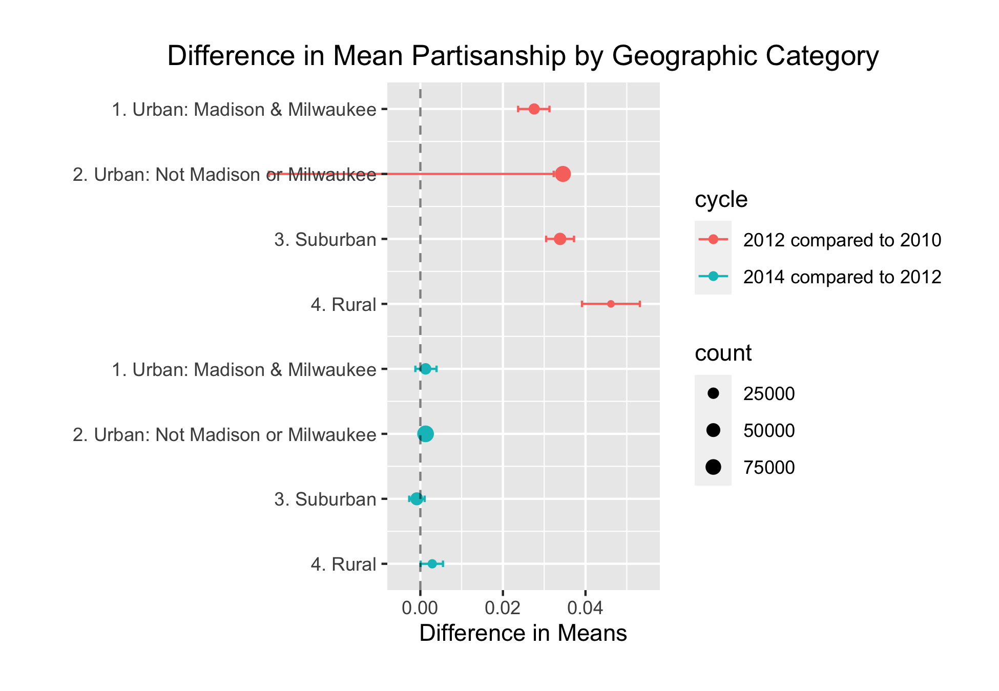
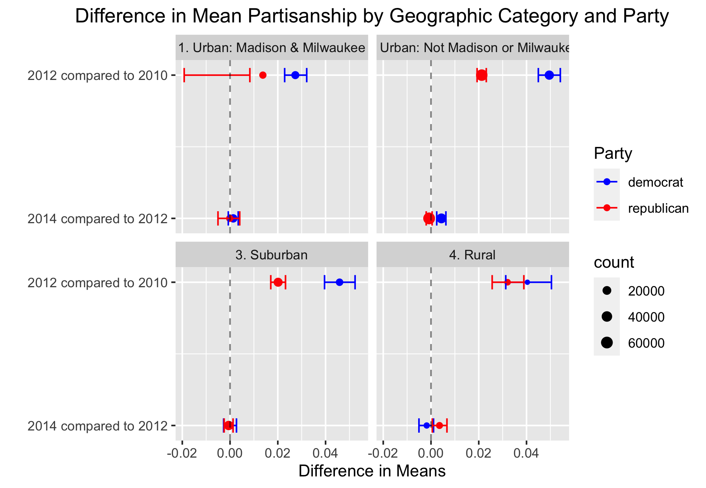

---
output:
  pdf_document:
    # citation_package: biblatex
    keep_tex: true
    fig_caption: true
    latex_engine: pdflatex
    template: ../svm-latex-ms.tex
title: "Political Donor Polarization"
thanks: 
author:
- name:
affiliation: 
date: "`r format(Sys.time(), '%B %d, %Y')`"
geometry: margin=1in
fontfamily: mathpazo
fontsize: 10pt
spacing: double
bibliography: ../bibliography.bib
biblio-style: apsr
header-includes: \usepackage{graphicx}
---

\newpage

```{r setup, include=FALSE}
knitr::opts_chunk$set(include = FALSE)
library(tidyverse)
library(infer)
library(igraph)

load("misc_data.Rdata")
```

``` {r}
donors_geo <- by_donor %>%
  mutate(zip = str_sub(refined_source_zip, -5, -1)) %>% 
  left_join(rucc) %>% 
  filter(state == "WI")
```


```{r}
geo_bootstrap <- function(year_1 = "2014",
                          year_2 = "2012",
                          replications = 100,
                          party = "Both",
                          donor_data = donors_geo) {
  year_1 <- as.character(year_1)
  year_2 <- as.character(year_2)
  
  set.seed(1)

  table <- tibble()
 
  for(category in levels(factor(donor_data$geo_category)))  {
      bootstrap <- donor_data %>% 
      filter(election_year %in% c(year_1, year_2)) %>% 
        {if(party != "Both") filter(., party_bin == party) else .} %>% 
      filter(geo_category == category) %>%
      specify(abs_partisanship ~ election_year) %>% 
      generate(reps = replications, type = "bootstrap") %>% 
      calculate(stat = "diff in means", order = c(year_1, year_2))
  
    table <- rbind(table,
                   cbind(`Geographic Category` = category, Party = party,
    bootstrap %>% 
      get_ci() %>% 
     cbind(bootstrap %>% 
              summarize(mean_diff = mean(stat))) %>% 
      cbind(bootstrap %>% 
             get_p_value(obs_stat = 0, direction = "two_sided"))) %>%
       tibble())
  }
  table
}
```


## Testing Difference in Mean Partisanship by Geography

```{r include = T, warning = F, echo = F, message = F}
geo_table <- geo_bootstrap(2012, 2010, 1000) %>% 
  mutate(cycle = "2012 compared to 2010") %>% 
  rbind(geo_bootstrap(2014,2012, 1000) %>% 
  mutate(cycle = "2014 compared to 2012")) %>% 
  mutate(ci = paste0(round(lower_ci, 5),"-",round(upper_ci, 5)),
         p_value = ifelse(p_value == 0, "<.001", p_value),
         mean_diff = round(mean_diff, 5)) %>% 
  select(`Geographic Category`, cycle, mean_diff, ci, p_value)

geo_table %>%
  knitr::kable(col.names = c("Geographic Category", "Election Year", "Diff.", "CI", "p"),
               caption = "Bootstrapped difference-in-means test with 1,000 replications comparing mean partisanship by geographic category.")
```


```{r}
geo_stats <- geo_table %>% 
  
  left_join(rbind(donors_geo %>% 
    mutate(indicator = ifelse(election_year %in% c(2012,2010), "yes", "no"),
           cycle = "2012 compared to 2010") %>%
    filter(indicator == "yes") %>% 
    group_by(geo_category, indicator, cycle) %>% 
    summarize(count= n()),
  donors_geo %>% 
    mutate(indicator = ifelse(election_year %in% c(2014,2012), "yes", "no"),
           cycle = "2014 compared to 2012") %>%
    filter(indicator == "yes") %>% 
    group_by(geo_category, indicator, cycle) %>% 
    summarize(count= n())) %>% 
  ungroup() %>% 
  select(-indicator),
    by = c("Geographic Category" = "geo_category", "cycle" = "cycle")) %>% 
  
  mutate(index = 8:1,
         lower = as.numeric(str_sub(ci, 1, -9)),
         upper = as.numeric(str_replace(ci, str_sub(ci, 1, -8), "")))
```

``` {r include = T, echo = F}
p1 <- ggplot(data = geo_stats, aes(y = index, x = mean_diff, xmin = lower, xmax = upper, color = cycle)) +
  geom_point(aes(size = count)) + 
  scale_size_continuous(range = c(1,3)) +
  geom_errorbarh(height = .1) +
  scale_y_continuous(name = "", breaks = 1:8, labels = rev(geo_stats$`Geographic Category`)) +
  labs(title = "Difference in Mean Partisanship by Geographic Category",
       x = "Difference in Means") +
  geom_vline(xintercept=0, color='black', linetype='dashed', alpha=.5) +
  #annotate(geom = "text", x = -.05, y = 1 + c(1.5, 5.5), label = c("2014 compared to 2012", "2012 compared to 2010"), size = 3.5, angle = 90) +
  coord_cartesian(xlim = c(-.005, .055), expand = T, clip = "off") +
  theme(plot.margin=unit(rep(.75, 4),"cm"), plot.title = element_text(hjust = .5))

ggsave(file = "geo_categories.png", plot = p1)

```

  I grouped the donors according the four geographic categories to run the same difference-in-means test. The summary statistics tells a story that largely agrees with the results for the statewide analysis in Table 2; Wisconsin donors significantly polarized in the 2012 election cycle across both metropolitan and nonmetropolitan areas and remained that way come the 2014 election cycle. These results may spark the question: should we consider donor geography when looking at polarization? The answer may be rooted in what Cramer describes as "rural consciousness," or the strong sense of identity that the rural Wisconsinites felt alongside resentment towards the two main cities in a rising right-wing populist movement. The people outside of Madison and Milwaukee resonated with Scott Walker's appeal to their sense of distributive power injustice which was reflected in Act 10's attack on public employee unions. Indeed we can look at rural Wisconsin as well as cities excluding Madison and Milwaukee, which encompass the majority of Wisconsin's population. These two geographic categories had the greatest increase in polarization in both election cycles and were significant in both years. This confirms continuing support for Scott Walker and reflects the rural consciousness that continued to grow even after the 2012 election.

\newpage

## Further Testing by Party 

```{r include = T, warning = F, echo = F, message = F}
party_geo_table <- geo_bootstrap(2012,2010, 1000, "democrat") %>% 
  mutate(cycle = "2012 compared to 2010") %>% 
  rbind(geo_bootstrap(2014,2012, 1000, "democrat") %>% 
  mutate(cycle = "2014 compared to 2012")) %>% 
  rbind(geo_bootstrap(2012,2010, 1000, "republican") %>% 
  mutate(cycle = "2012 compared to 2010")) %>% 
  rbind(geo_bootstrap(2014,2012, 1000, "republican") %>% 
  mutate(cycle = "2014 compared to 2012")) %>% 
  mutate(ci = paste0(round(lower_ci, 5),"-",round(upper_ci, 5)),
         p_value = ifelse(p_value == 0, "<.001", p_value),
         mean_diff = round(mean_diff, 5)) %>% 
  select(`Geographic Category`, Party, cycle, mean_diff, ci, p_value)

party_geo_table %>%
  knitr::kable(col.names = c("Geographic Category", "Party", "Election Year", "Diff.", "CI", "p"),
               caption = "Bootstrapped difference-in-means test with 1,000 replications comparing mean partisanship by geographic category.")
```

```{r}
party_geo_stats <- party_geo_table %>% 
  
  left_join(rbind(donors_geo %>% 
    mutate(indicator = ifelse(election_year %in% c(2012,2010), "yes", "no"),
           cycle = "2012 compared to 2010") %>%
    filter(indicator == "yes") %>% 
    group_by(geo_category, indicator, cycle, party_bin) %>% 
    summarize(count= n()),
  donors_geo %>% 
    mutate(indicator = ifelse(election_year %in% c(2014,2012), "yes", "no"),
           cycle = "2014 compared to 2012") %>%
    filter(indicator == "yes") %>% 
    group_by(geo_category, indicator, cycle, party_bin) %>% 
    summarize(count= n())) %>% 
  ungroup() %>% 
  select(-indicator),
    by = c("Geographic Category" = "geo_category", "cycle" = "cycle", "Party" = "party_bin")) %>% 
  
  mutate(index = rep(c(rep(2,4), rep(1,4)), 2),
         lower = as.numeric(str_sub(ci, 1, -9)),
         upper = as.numeric(str_replace(ci, str_sub(ci, 1, -8), "")))
```

``` {r include = T, echo = F}
p2 <- ggplot(data = party_geo_stats, aes(y = index, x = mean_diff, xmin = lower, xmax = upper, color = Party)) +
  facet_wrap(~`Geographic Category`) +
  scale_color_manual(values=c("blue", "red")) + 
  geom_point(aes(size = count)) + 
  scale_size_continuous(range = c(1,3)) +
  geom_errorbarh(height = .1) +
  scale_y_continuous(name = "", breaks = 1:2, labels = c("2014 compared to 2012", "2012 compared to 2010")) +
  labs(title = "Difference in Mean Partisanship by Geographic Category and Party",
       x = "Difference in Means") +
  geom_vline(xintercept = 0, color = 'black', linetype = 'dashed', alpha = .5) + 
  theme(plot.title = element_text(hjust = .5))

ggsave(file="geo_and_parties.png", plot = p2)

```
To further analyze the partisan trends between Democrats and Republicans, I ran the same bootstrapping test for both parties in each of the geographic categories. In the 2012 compared to 2010 cycle, both parties had a significant mean difference in partisanship across the entire state, with Democrats consistently increasing their partisanship compared to Republicans. This aligns with the massive push to replace Governor Walker in the 2012 recall elections. Interestingly, despite the efforts among Democratic donors, the outcome of the election was not in their favor.

We can then move to note that in the 2014 to 2012 cycle, the Urban excluding Madison and Milwaukee and the Rural categories still had significant differences in partisanship. With this in mind, running the bootstrapping test allows us to see if this was true across both parties in these regions. The results of the test show that this was not the case. Somewhat unsurprisingly, only the  Republican donors had a significant difference in partisanship from 2012 to 2014. This can possibly be linked to the growing "rural consciousness" that rural Republicans felt as they continued to identify with Scott Walker's ideas. On the other hand, in urban Wisconsin outside of the two major cities, it was Democratic donors that had a super significant difference in partisanship in 2014 while Republican donors remained unchanged...

\newpage

## Extracting key cities from the geographic category '2. Urban. Not Madison or Milwaukee'

Data taken from https://www.unitedstateszipcodes.org/wi/

```{r}
city_zip_county <- read.csv("zip_code_database.csv") %>% 
  filter(state == "WI") %>% 
  mutate(zip = as.character(zip)) %>% 
  rename(countyname = county) %>% 
  select(zip, state, primary_city, countyname, latitude, longitude)
```


```{r}
urban2cities <- rucc %>% 
  filter(geo_category == "2. Urban: Not Madison or Milwaukee") %>% 
  left_join(city_zip_county, by = c("zip", "state"))

mean(urban2cities$countyname.x == urban2cities$countyname.y)
```

```{r}
rucc_cities2 <- urban2cities %>% 
  arrange(primary_city) %>% 
  select(primary_city) %>% 
  distinct() %>% 
  unlist(use.names = FALSE)
```


```{r echo = F}
ggplot(data = geo_stats, aes(x = cycle, y = mean_diff, fill = cycle)) +
  facet_grid(~`Geographic Category`) + 
  geom_errorbar(aes(ymin = lower, ymax = upper), width = 0.25, colour="black") +
  geom_bar(stat="identity",position=position_dodge()) +
  labs(title="Difference in Mean Partisanship by Geographic Category", x="", y = "Mean Difference", position=position_dodge(.9)) +
  scale_fill_manual(values=c("gray40", "gray70")) +
  theme(legend.position="bottom", plot.title = element_text(hjust = .5), axis.text.x = element_blank(), strip.text.x = element_text(size = 7))
```

\newpage

## Comparing Old and New Donors (for a given election year)

```{r}
new_old_bootstrap <- function(year = 2012,
                          replications = 100) {
  set.seed(1)
  
  bootstrap <- by_donor %>% 
    filter(election_year == year) %>% 
    mutate(status = ifelse(refined_source_zip %in% unlist((by_donor %>% filter(election_year == year - 2) %>% select(refined_source_zip))), "old", "new")) %>% 
    specify(abs_partisanship ~ status) %>% 
    generate(reps = replications, type = "bootstrap") %>% 
    calculate(stat = "diff in means", order = c("new", "old"))
  
  bootstrap %>% 
    get_ci() %>% 
    cbind(bootstrap %>% 
            summarize(mean_diff = mean(stat))) %>% 
    cbind(bootstrap %>% 
            get_p_value(obs_stat = 0, direction = "two_sided"))
}
```

```{r include = T, warning = F, echo = F, message = F}
new_old_table <-  cbind(year = c("2012", "2014"),
  rbind(new_old_bootstrap(2012, 1000), new_old_bootstrap(2014, 1000))) %>%
            tibble() %>% 
            unnest() %>% 
  mutate(ci = paste0(round(lower_ci, 5),"-",round(upper_ci, 5)),
         p_value = ifelse(p_value == 0, "<.001", p_value),
         mean_diff = round(mean_diff, 5)) %>% 
  select(year, mean_diff, ci, p_value)

new_old_table %>%
  knitr::kable(col.names = c("Election Year", "Diff.", "CI", "p"),
               caption = "Bootstrapped difference-in-means test with 1,000 replications comparing mean partisanship of new versus old donors.")
```

\newpage

```{r include = T, echo = F}
donor_stats <- donors_geo %>% 
  group_by(election_year, geo_category, party_bin) %>% 
  filter(party_bin %in% c("democrat", "republican")) %>% 
  summarise(total = n()) %>% 
  pivot_wider(names_from = "party_bin", values_from = "total") %>% 
  left_join(donors_geo %>% 
              filter(party_bin %in% c("democrat", "republican")) %>% 
              group_by(election_year, geo_category) %>% 
              summarise(Democrat_per = sum(dem) / sum(total_contributions),
                        Republican_per = sum(rep) / sum(total_contributions))) %>% 
  left_join(donors_geo %>% 
  group_by(election_year, geo_category, party_bin) %>% 
  filter(party_bin %in% c("democrat", "republican")) %>% 
  summarise(total = n()) %>% 
  left_join(donors_geo %>% 
  filter(party_bin %in% c("democrat", "republican")) %>% 
  group_by(election_year, party_bin) %>% 
  summarise(year_total = n())) %>% 
  mutate(percent = total / year_total) %>% 
  select(-c(total, year_total)) %>% 
  pivot_wider(names_from = "party_bin", values_from = "percent") %>% 
  rename("yearly_dem" = "democrat",
         "yearly_rep" = "republican"))

donor_stats %>%
  knitr::kable(col.names = c("Election Year", "Geographic Cateogory", "Democratic Donors", "Republican Donors", "% Dem donations","% Rep donations", "% of yearly Dem donors", "% of yearly Rep donors"),
               caption = "Number of Donors, Proportion of Donations, and Percentage of Donors from each Geographic Category per Year")
```

```{r include = T, echo = F}
donor_stats %>% 
  pivot_longer(c(democrat, republican), names_to = "Party", values_to = "num_donors") %>% 
  ggplot(aes(x = Party, y = num_donors, fill = geo_category)) + geom_bar(position = "stack", stat = "identity") +
  facet_wrap(~election_year) +
  labs(title = "Number of Donors from each Geographic Cateogory", x = "Party", y = "Number of Donors", fill = "Geographic Category")
```

```{r include = T, echo = F}
donor_stats %>% 
  select(-c(democrat, republican)) %>% 
  rename("Democrat" = "yearly_dem",
         "Republican" = "yearly_rep") %>% 
  pivot_longer(c(Democrat, Republican), names_to = "party_percent", values_to = "yearly_percent") %>% 
  ggplot(aes(x = election_year, y = yearly_percent, group = geo_category, fill = geo_category)) + 
  geom_bar(position = "fill", stat = "identity") + 
  facet_grid(~party_percent) + 
  labs(title = "Proportion of Donors from each Geographic Cateogory", x = "Election Year", y = "Proportion of Donors", fill = "Geographic Category")
```

The first plot shows the number of donors in each geographic category by party and year, while the second graph breaks it down by percentages to see where donors are coming from. It is obvious that the divisive election of 2012 was reflected in a huge influx of donors from both parties. Looking at the proportions, we see that the distribution of donors across geographic categories remained largely consistent across election years. Republican donors came from predominately the non-Madison-or-Milwaukee urban category, while the Democratic party was dominated by the two urban regions.

\newpage

## Incorprating Size of Donations

### Use $200 cutoff to compare small and large donors

```{r}
amount_bootstrap <- function(year = 2012,
                          replications = 100) {
  set.seed(1)
  
  bootstrap <- by_donor %>% 
    filter(election_year == year) %>% 
    mutate(size_cutoff = ifelse(total_contributions >= 200, "big", "small")) %>% 
    specify(abs_partisanship ~ size_cutoff) %>% 
    generate(reps = replications, type = "bootstrap") %>% 
    calculate(stat = "diff in means", order = c("small", "big"))
  
  bootstrap %>% 
    get_ci() %>% 
    cbind(bootstrap %>% 
            summarize(mean_diff = mean(stat))) %>% 
    cbind(bootstrap %>% 
            get_p_value(obs_stat = 0, direction = "two_sided"))
}
```

```{r include = T, warning = F, echo = F, message = F}
amount_table <-  cbind(year = c("2010", "2012", "2014"),
  rbind(amount_bootstrap(2010, 1000), amount_bootstrap(2012, 1000), amount_bootstrap(2014, 1000))) %>%
            tibble() %>% 
            unnest() %>% 
  mutate(ci = paste0(round(lower_ci, 5),"-",round(upper_ci, 5)),
         p_value = ifelse(p_value == 0, "<.001", p_value),
         mean_diff = round(mean_diff, 5)) %>% 
  select(year, mean_diff, ci, p_value)

amount_table %>%
  knitr::kable(col.names = c("Election Year", "Diff.", "CI", "p"),
               caption = "Bootstrapped difference-in-means test with 1,000 replications comparing mean partisanship of small versus big donors.")
```

``` {r include = T, echo = F}
amount_table %>% 
  mutate(lower = as.numeric(str_sub(ci, 1, -9)),
         upper = as.numeric(str_replace(ci, str_sub(ci, 1, -8), ""))) %>% 
  ggplot(aes(y = year, x = mean_diff, xmin = lower, xmax = upper)) +
  geom_point() +
  geom_errorbarh(height = .1) +
  labs(title = "Difference in Mean Partisanship between Large and Small Donors",
       x = "Difference in Means", y = "Election Year") +
  geom_vline(xintercept = 0, color = 'black', linetype = 'dashed', alpha = .5) + 
  theme(plot.title = element_text(hjust = .5))
```

From the results, small donors are significantly more polarized compared to big donors in all election years.

\newpage

## Different Urban/Rural Classifications

### Urban Inflence Codes (2013)

From
https://www.ugpti.org/resources/reports/downloads/dp-207.pdf 


"The Economic Research Service uses metropolitan, micropolitan, and non-core designations; population; and proximity to large urban areas to classify counties using its Urban Influence Code system. Micropolitan Statistical Areas are similar to Metropolitan Areas with the exception that the core urban area must have at least 10,000 residents. Metropolitan and Micropolitan Statistical Areas are jointly referred to as Core Based Statistical Areas. The Urban Influence system is intended to capture the role of urban areas and access on economic opportunity."


Using Urban Influence Codes might be an attractive option because it aims to classify geography by access to economic opportunity, which links to the rural resentment felt by nonmetropolitan Wisconsinites. Also the finer distinctions between nonmetro areas might be useful to separate and look at.

``` {r include = T, echo = F}
uic_classes <- cbind(c(paste(1:2, "Metropolitan"), paste(3:12, "Nonmetropolitan")), c("In large metro area of 1+ million residents", "In small metro area of less than 1 million residents","Micropolitan area adjacent to large metro area","Noncore adjacent to large metro area","Micropolitan area adjacent to small metro area","Noncore adjacent to small metro area and contains a town of at least 2,500 residents","Noncore adjacent to small metro area and does not contain a town of at least 2,500 residents","Micropolitan area not adjacent to a metro area","Noncore adjacent to micro area and contains a town of at least 2,500 residents","Noncore adjacent to micro area and does not contain a town of at least 2,500 residents","Noncore not adjacent to metro or micro area and contains a town of at least 2,500 residents","Noncore not adjacent to metro or micro area and does not contain a town of at least 2,500 residents"))

uic_classes %>%
  knitr::kable(col.names = c("Geographic Cateogry", "Description"),
               caption = "Urban Influence Codes")
```

```{r}
uic <- read_csv("UrbanInfluenceCodes2013.csv") %>% 
  filter(State == "WI") %>% 
  rename("fips" = "FIPS", "county_name" = "County_Name")
```


```{r}
donors_uic <- donors_geo %>%
  left_join(uic) %>% 
  filter(state == "WI") %>% 
  rename("rucc_geo" = "geo_category") %>% 
  mutate(geo_category = case_when(
    UIC_2013 == 1 ~ "1. Urban: 1+ million residents",
    UIC_2013 == 2 ~ "2. Urban: Less than 1 million residents",
    UIC_2013 %in% c(3, 5, 8) ~ "3. Micropolitan", 
    UIC_2013 %in% c(4, 6, 7, 9:12) ~ "4. Noncore"))
```

I decided to recode the donors by UIC codes similarly to the RUCC categories: 2 urban, one suburban, and one rural category. I summarized the donors in the table below. 


```{r include = T, echo = F}
uic_stats <- donors_uic %>% 
  group_by(election_year, geo_category, party_bin) %>% 
  filter(party_bin %in% c("democrat", "republican")) %>% 
  summarise(total = n()) %>% 
  pivot_wider(names_from = "party_bin", values_from = "total") %>% 
  left_join(donors_uic %>% 
              filter(party_bin %in% c("democrat", "republican")) %>% 
              group_by(election_year, geo_category) %>% 
              summarise(Democrat_per = sum(dem) / sum(total_contributions),
                        Republican_per = sum(rep) / sum(total_contributions))) %>% 
  left_join(donors_uic %>% 
  group_by(election_year, geo_category, party_bin) %>% 
  filter(party_bin %in% c("democrat", "republican")) %>% 
  summarise(total = n()) %>% 
  left_join(donors_uic %>% 
  filter(party_bin %in% c("democrat", "republican")) %>% 
  group_by(election_year, party_bin) %>% 
  summarise(year_total = n())) %>% 
  mutate(percent = total / year_total) %>% 
  select(-c(total, year_total)) %>% 
  pivot_wider(names_from = "party_bin", values_from = "percent") %>% 
  rename("yearly_dem" = "democrat",
         "yearly_rep" = "republican"))

uic_stats %>%
  knitr::kable(col.names = c("Election Year", "Geographic Cateogry", "Democratic Donors", "Republican Donors", "% Dem donations","% Rep donations", "% of yearly Dem donors", "% of yearly Rep donors"),
               caption = "Number of Donors, Proportion of Donations, and Percentage of Donors from each Geographic Category per Year")
```

```{r include = T, echo = F}
uic_stats %>% 
  pivot_longer(c(democrat, republican), names_to = "Party", values_to = "num_donors") %>% 
  ggplot(aes(x = Party, y = num_donors, fill = geo_category)) + geom_bar(position = "stack", stat = "identity") +
  facet_wrap(~election_year) +
  labs(title = "Number of Donors from each Geographic Cateogory", x = "Party", y = "Number of Donors", fill = "Geographic Category")
```

The image looks very similar to the RUCC classification, except with less suburban and more rural-classified donors. I ran the test on all the categories without grouping.

```{r include = T, warning = F, echo = F, message = F}
uic_geo_all <- geo_bootstrap(2012, 2010, 1000, 
                             donor_data = donors_uic %>% 
                               rename("geo_category_recoded" = "geo_category", "geo_category" = "UIC_2013")) %>% 
  mutate(cycle = "2012 compared to 2010") %>% 
  rbind(geo_bootstrap(2014, 2012, 1000, donor_data = 
                        donors_uic %>% 
                               rename("geo_category_recoded" = "geo_category", "geo_category" = "UIC_2013")) %>% 
  mutate(cycle = "2014 compared to 2012")) %>% 
  mutate(ci = paste0(round(lower_ci, 5),"-",round(upper_ci, 5)),
         p_value = ifelse(p_value == 0, "<.001", p_value),
         mean_diff = round(mean_diff, 5)) %>% 
  select(`Geographic Category`, cycle, mean_diff, ci, p_value)

uic_geo_all %>%
  knitr::kable(col.names = c("Geographic Category", "Election Year", "Diff.", "CI", "p"),
               caption = "Bootstrapped difference-in-means test with 1,000 replications comparing mean partisanship by geographic category.")
```


```{r include = T, warning = F, echo = F, message = F}
uic_geo <- geo_bootstrap(2012, 2010, 1000, donor_data = donors_uic) %>% 
  mutate(cycle = "2012 compared to 2010") %>% 
  rbind(geo_bootstrap(2014, 2012, 1000, donor_data = donors_uic) %>% 
  mutate(cycle = "2014 compared to 2012")) %>% 
  mutate(ci = paste0(round(lower_ci, 5),"-",round(upper_ci, 5)),
         p_value = ifelse(p_value == 0, "<.001", p_value),
         mean_diff = round(mean_diff, 5)) %>% 
  select(`Geographic Category`, cycle, mean_diff, ci, p_value)

uic_geo %>%
  knitr::kable(col.names = c("Geographic Category", "Election Year", "Diff.", "CI", "p"),
               caption = "Bootstrapped difference-in-means test with 1,000 replications comparing mean partisanship by geographic category.")
```

The difference-in-means test resulted in only the first urban category to be significant, which is different from what the RUCC data gave us (with both the 2nd urban category and rural significant). Finally, I decided to group into six categories based on adjacency to urban areas and ran the same test. Again, only the first category was significant for the 2014 election cycle.


```{r}
donors_uic_adj <- donors_geo %>%
  left_join(uic) %>% 
  filter(state == "WI") %>% 
  rename("rucc_geo" = "geo_category") %>% 
  mutate(geo_category = case_when(
    UIC_2013 == 1 ~ "1. Urban: 1+ million residents",
    UIC_2013 == 2 ~ "2. Urban: Less than 1 million residents",
    UIC_2013 %in% c(3, 5) ~ "3. Micropolitan: Adjacent to an urban area", 
    UIC_2013 == 8 ~ "4. Micropolitan: Not adjacent to an urban area",
    UIC_2013 %in% c(4, 6, 7, 9, 10) ~ "5. Noncore: Adjacent to a metro area",
    UIC_2013 %in% c(11, 12) ~ "6. Noncore: Not Adjacent a metro area"))
```


```{r include = T, warning = F, echo = F, message = F}
uic_geo_adj <- geo_bootstrap(2012, 2010, 1000, donor_data = donors_uic_adj) %>% 
  mutate(cycle = "2012 compared to 2010") %>% 
  rbind(geo_bootstrap(2014, 2012, 1000, donor_data = donors_uic_adj) %>% 
  mutate(cycle = "2014 compared to 2012")) %>% 
  mutate(ci = paste0(round(lower_ci, 5),"-",round(upper_ci, 5)),
         p_value = ifelse(p_value == 0, "<.001", p_value),
         mean_diff = round(mean_diff, 5)) %>% 
  select(`Geographic Category`, cycle, mean_diff, ci, p_value)

uic_geo_adj %>%
  knitr::kable(col.names = c("Geographic Category", "Election Year", "Diff.", "CI", "p"),
               caption = "Bootstrapped difference-in-means test with 1,000 replications comparing mean partisanship by geographic category.")
```
\newpage

### CDC's 2013 NCHS Urban–Rural Classification Scheme for Counties

From
https://www.cdc.gov/nchs/data/series/sr_02/sr02_166.pdf

"A key feature of the NCHS urban-rural scheme, which makes it particularly well-suited for health analyses, is that it separates counties within large metropolitan areas (1 million or more population) into two categories: large “central” metro (akin to inner cities) and large “fringe” metro (akin to suburbs). This is an important feature of the NCHS urban-rural scheme because for a number of health measures, residents of large fringe metro areas fare substantially better than residents of other urbanization levels. For these measures, residents of the inner cities and suburbs of large metropolitan areas must be differentiated to obtain an accurate characterization of health disparities across the full urban-rural spectrum."


The NCHS classification scheme primarily uses population as its measure of urbanization, and it tries to capture health (quality of life?) is that urban areas are broken up more, with even more specificity between a "large central metro" and a "large fringe metro." I thought that this turned out useful later. Also I didn't think regrouping was necessary since the six categories seemed pretty clear.

```{r include = T, echo = F}
nchs_classes <- cbind(c("1. Large Central Metro", "2. Large Fringe Metro", "3. Medium Metro", "4. Small Metro", "5. Micropolitan", "6. Noncore"), c("Counties in MSAs of 1 million or more population that: 1) Contain the entire population of the largest principal city of the MSA, or 2) Have their entire population contained in the largest principal city of the MSA, or 3) Contain at least 250,000 inhabitants of any principal city of the MSA", "Counties in MSAs of 1 million or more population that did not qualify as large central metro counties","Counties in MSAs of populations of 250,000–999,999","Counties in MSAs of populations less than 250,000","Counties in micropolitan statistical areas","Nonmetropolitan counties that did not qualify as micropolitan"))

nchs_classes %>%
  knitr::kable(col.names = c("Urbanization Level", "Classification Rules"),
               caption = "NCHS Urban-Rural Scheme")
```
 
```{r}
nchs <- read.csv("NCHSURCodes2013.csv") %>% 
  rename("state" = "State.Abr.",
         "county_name" = "County.name",
         "nchs_2013" = "X2013.code") %>% 
  filter(state == "WI") %>% 
  mutate(fips = as.character(FIPS.code))
```

```{r}
donors_nchs <- donors_geo %>%
  left_join(nchs) %>% 
  filter(state == "WI") %>% 
  rename("rucc_geo" = "geo_category") %>% 
  mutate(geo_category = case_when(
    nchs_2013 == 1 ~ "1. Large Central Metro",
    nchs_2013 == 2 ~ "2. Large Fringe Metro",
    nchs_2013 == 3 ~ "3. Medium Metro", 
    nchs_2013 == 4 ~ "4. Small Metro",
    nchs_2013 == 5 ~ "5. Micropolitan",
    nchs_2013 == 6 ~ "6. Noncore"))
```

```{r include = T, echo = F}
nchs_stats <- donors_nchs %>% 
  group_by(election_year, geo_category, party_bin) %>% 
  filter(party_bin %in% c("democrat", "republican")) %>% 
  summarise(total = n()) %>% 
  pivot_wider(names_from = "party_bin", values_from = "total") %>% 
  left_join(donors_nchs%>% 
              filter(party_bin %in% c("democrat", "republican")) %>% 
              group_by(election_year, geo_category) %>% 
              summarise(Democrat_per = sum(dem) / sum(total_contributions),
                        Republican_per = sum(rep) / sum(total_contributions))) %>% 
  left_join(donors_nchs %>% 
  group_by(election_year, geo_category, party_bin) %>% 
  filter(party_bin %in% c("democrat", "republican")) %>% 
  summarise(total = n()) %>% 
  left_join(donors_nchs %>% 
  filter(party_bin %in% c("democrat", "republican")) %>% 
  group_by(election_year, party_bin) %>% 
  summarise(year_total = n())) %>% 
  mutate(percent = total / year_total) %>% 
  select(-c(total, year_total)) %>% 
  pivot_wider(names_from = "party_bin", values_from = "percent") %>% 
  rename("yearly_dem" = "democrat",
         "yearly_rep" = "republican"))

nchs_stats %>%
  knitr::kable(col.names = c("Election Year", "Geographic Cateogry", "Democratic Donors", "Republican Donors", "% Dem donations","% Rep donations", "% of yearly Dem donors", "% of yearly Rep donors"),
               caption = "Number of Donors, Proportion of Donations, and Percentage of Donors from each Geographic Category per Year")
```

```{r}
nchs %>% 
  filter(nchs_2013 == 1) %>% 
  distinct(county_name)
```


```{r include = T, echo = F}
nchs_stats %>% 
  pivot_longer(c(democrat, republican), names_to = "Party", values_to = "num_donors") %>% 
  ggplot(aes(x = Party, y = num_donors, fill = geo_category)) + geom_bar(position = "stack", stat = "identity") +
  facet_wrap(~election_year) +
  labs(title = "Number of Donors from each Geographic Cateogory", x = "Party", y = "Number of Donors", fill = "Geographic Category")
```
\newpage


```{r include = T, warning = F, echo = F, message = F}
nchs_geo <- geo_bootstrap(2012, 2010, 1000, donor_data = donors_nchs) %>% 
  mutate(cycle = "2012 compared to 2010") %>% 
  rbind(geo_bootstrap(2014, 2012, 1000, donor_data = donors_nchs) %>% 
  mutate(cycle = "2014 compared to 2012")) %>% 
  mutate(ci = paste0(round(lower_ci, 5),"-",round(upper_ci, 5)),
         p_value = ifelse(p_value == 0, "<.001", p_value),
         mean_diff = round(mean_diff, 5)) %>% 
  select(`Geographic Category`, cycle, mean_diff, ci, p_value)

nchs_geo %>%
  knitr::kable(col.names = c("Geographic Category", "Election Year", "Diff.", "CI", "p"),
               caption = "Bootstrapped difference-in-means test with 1,000 replications comparing mean partisanship by geographic category.")
```

I ran the same bootstrapping test on the donor data based on the NCHS scheme and saw that in 2014, both urban areas got significantly more polarized. This disagrees with the rucc scheme, which showed that Madison and Milwaukee did not get significantly more polarized in 2014. I decided to pull the cities from the "Large Fringe" group and found that they were a subset of the "2. Urban: Not Madison and Milwaukee" category.

The results of further testing by party are below:


```{r include = T, warning = F, echo = F, message = F}
nchs_geo_party <- geo_bootstrap(2012,2010, 1000, "democrat", donors_nchs) %>% 
  mutate(cycle = "2012 compared to 2010") %>% 
  rbind(geo_bootstrap(2014,2012, 1000, "democrat", donors_nchs) %>% 
  mutate(cycle = "2014 compared to 2012")) %>% 
  rbind(geo_bootstrap(2012,2010, 1000, "republican", donors_nchs) %>% 
  mutate(cycle = "2012 compared to 2010")) %>% 
  rbind(geo_bootstrap(2014,2012, 1000, "republican", donors_nchs) %>% 
  mutate(cycle = "2014 compared to 2012")) %>% 
  mutate(ci = paste0(round(lower_ci, 5),"-",round(upper_ci, 5)),
         p_value = ifelse(p_value == 0, "<.001", p_value),
         mean_diff = round(mean_diff, 5)) %>% 
  select(`Geographic Category`, Party, cycle, mean_diff, ci, p_value)

nchs_geo_party %>%
  knitr::kable(col.names = c("Geographic Category", "Party", "Election Year", "Diff.", "CI", "p"),
               caption = "Bootstrapped difference-in-means test with 1,000 replications comparing mean partisanship by geographic category.")
```

```{r}
large_fringe <- donors_nchs %>% 
  filter(geo_category == "2. Large Fringe Metro") %>% 
  left_join(city_zip_county, by = c("zip", "state"))

mean(large_fringe$countyname.x == large_fringe$countyname.y)

nchs_cities2 <- large_fringe %>% 
  arrange(primary_city) %>% 
  select(primary_city) %>% 
  distinct() %>% 
  unlist(use.names = FALSE)

all(rucc_cities2[rucc_cities2 %in% nchs_cities2] == nchs_cities2)

donors_nchs %>% 
  filter(geo_category == "2. Large Fringe Metro") %>% 
  distinct(county_name)
```


```{r}
nchs_party_stats <- nchs_geo_party %>% 
  left_join(rbind(donors_nchs %>% 
    mutate(indicator = ifelse(election_year %in% c(2012,2010), "yes", "no"),
           cycle = "2012 compared to 2010") %>%
    filter(indicator == "yes") %>% 
    group_by(geo_category, indicator, cycle, party_bin) %>% 
    summarize(count= n()),
  donors_nchs %>% 
    mutate(indicator = ifelse(election_year %in% c(2014,2012), "yes", "no"),
           cycle = "2014 compared to 2012") %>%
    filter(indicator == "yes") %>% 
    group_by(geo_category, indicator, cycle, party_bin) %>% 
    summarize(count= n())) %>% 
  ungroup() %>% 
  select(-indicator),
    by = c("Geographic Category" = "geo_category", "cycle" = "cycle", "Party" = "party_bin")) %>% 
  
  mutate(index = rep(c(rep(2,6), rep(1,6)), 2),
         lower = as.numeric(str_sub(ci, 1, -9)),
         upper = as.numeric(str_replace(ci, str_sub(ci, 1, -8), "")))
```

``` {r include = T, echo = F}
ggplot(data = nchs_party_stats, aes(y = index, x = mean_diff, xmin = lower, xmax = upper, color = Party)) +
  facet_wrap(~`Geographic Category`) +
  scale_color_manual(values=c("blue", "red")) + 
  geom_point(aes(size = count)) + 
  scale_size_continuous(range = c(1,3)) +
  geom_errorbarh(height = .1) +
  scale_y_continuous(name = "", breaks = 1:2, labels = c("2014 compared to 2012", "2012 compared to 2010")) +
  labs(title = "Difference in Mean Partisanship by Geographic Category and Party",
       x = "Difference in Means") +
  geom_vline(xintercept = 0, color = 'black', linetype = 'dashed', alpha = .5) + 
  theme(plot.title = element_text(hjust = .5))
```
\newpage

### Rural-Urban Commuting Area Codes (RUCAs)

From
https://depts.washington.edu/uwruca/index.php 

"RUCAs, Rural-Urban Commuting Area Codes, are a new Census tract-based classification scheme that utilizes the standard Bureau of Census Urbanized Area and Urban Cluster definitions in combination with work commuting information to characterize all of the nation's Census tracts regarding their rural and urban status and relationships. In addition, a ZIP Code RUCA approximation was developed."


Documentation for variables:
https://depts.washington.edu/uwruca/ruca-documentation.php

UA=Urbanized Area
UC=Urban Cluster

```{r include = T, echo = F}
ruca_classes <- cbind(c(1:10), c("Metropolitan area core: primary flow within an Urbanized Area (UA)", "Metropolitan area high commuting: primary flow 30% or more to a UA", "Metropolitan area low commuting: primary flow 10% to 30% to a UA", "Micropolitan* area core: primary flow within an Urban Cluster (UC) of 10,000 through 49,999 (large UC)", "Micropolitan* high commuting: primary flow 30% or more to a large UC", "Micropolitan* low commuting: primary flow 10% to 30% to a large UC", "Small town core: primary flow within an Urban Cluster of 2,500 through 9,999 (small UC)","Small town high commuting: primary flow 30% or more to a small UC", "Small town low commuting: primary flow 10% through 29% to a small UC","Rural areas: primary flow to a tract outside a UA or UC (including self)"))

ruca_classes %>%
  knitr::kable(col.names = c("RUCA Code", "Description"),
               caption = "Rural-Urban Commuting Area Codes")
```

Each category had a couple of subcategories (7, 7.1, 7.2, etc) to further break down the categories but I simplified it just by taking the floor of the full code (everything rounds down).

```{r}
ruca <- read.csv("ruca2_WI.csv") %>% 
  rename("zip" = "ZIPN", "ruca" = "RUCA2") %>% 
  mutate(zip = as.character(zip))
```

```{r}
donors_ruca <- donors_geo %>%
  left_join(ruca) %>% 
  rename("rucc_geo" = "geo_category") %>% 
  mutate(geo_category = floor(ruca))
```

```{r include = T, warning = F, echo = F, message = F}
ruca_geo <- geo_bootstrap(2012, 2010, 1000, donor_data = donors_ruca) %>% 
  mutate(cycle = "2012 compared to 2010") %>% 
  rbind(geo_bootstrap(2014, 2012, 1000, donor_data = donors_ruca) %>% 
  mutate(cycle = "2014 compared to 2012")) %>% 
  mutate(ci = paste0(round(lower_ci, 5),"-",round(upper_ci, 5)),
         p_value = ifelse(p_value == 0, "<.001", p_value),
         mean_diff = round(mean_diff, 5)) %>% 
  select(`Geographic Category`, cycle, mean_diff, ci, p_value)

ruca_geo %>%
  knitr::kable(col.names = c("Geographic Category", "Election Year", "Diff.", "CI", "p"),
               caption = "Bootstrapped difference-in-means test with 1,000 replications comparing mean partisanship by geographic category.")
```
```{r}
ruca4 <- donors_ruca %>% 
  filter(geo_category == 4) %>% 
  left_join(city_zip_county, by = c("zip", "state"))

mean(ruca4$countyname.x == ruca4$countyname.y)

ruca_cities4 <- ruca4 %>% 
  arrange(primary_city) %>% 
  select(primary_city) %>% 
  distinct() %>% 
  unlist(use.names = FALSE)

length(ruca_cities4)
sum(ruca_cities4 %in% nchs_cities2)
ruca_cities4[ruca_cities4 %in% nchs_cities2]
```

```{r}
ruca7 <- donors_ruca %>% 
  filter(geo_category == 7) %>% 
  left_join(city_zip_county, by = c("zip", "state"))

mean(ruca7$countyname.x == ruca7$countyname.y)

ruca_cities7 <- ruca7 %>% 
  arrange(primary_city) %>% 
  select(primary_city) %>% 
  distinct() %>% 
  unlist(use.names = FALSE)
```

## The Divided (But Not More Predictable) Electorate: A Machine Learning Analysis of Voting in American Presidential Election

https://preprints.apsanet.org/engage/api-gateway/apsa/assets/orp/resource/item/6050dba7df04091d6a7fb4ef/original/the-divided-but-not-more-predictable-electorate-a-machine-learning-analysis-of-voting-in-american-presidential-elections.pdf

	- Demographics have not become more predictive of vote choice
		- When all variables are included and some sort of stepping is performed, demographics do not make it into top 10 predictors
	- Focus on 5 demographic markers: race, education, income, age, gender

Main method used: random forests to predict voting predictions, using data from five surveys
		- Also a logistic regression for voice choice as y-variable, and CART model to confirm results

General results: demographics alone is a bad predictor (65% ish or less)


```{r}
decile_breaks <- levels(cut(donors_geo$total_contributions, 
                     breaks = quantile(donors_geo$total_contributions, probs=seq(0,1, by=0.1)), 
                     include.lowest=TRUE))

recoded_donors <- donors_geo %>% 
  mutate(range = cut(total_contributions, 
                     breaks = quantile(total_contributions, probs=seq(0,1, by=0.1)), 
                     include.lowest=TRUE),
         bin = as.integer(range))
```


